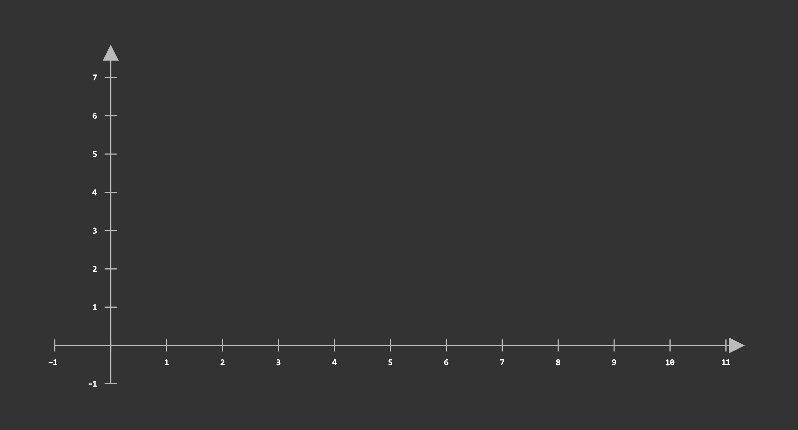

# Симуляция полёта тела

Данная программа работает с помощью модуля `manim` представляет анимацию полёта тела с параметрами, заданными в `data.csv`.

## Использование

1. Установите зависимости проекта:

`pip install -r requirements.txt`

2. Измените содержимое файла `data.csv` на собственные данные:

`3;60;10` - ВЫСОТА (М); УГОЛ БРОСАНИЯ (ГРАДУСЫ); НАЧАЛЬНАЯ СКОРОСТЬ (М / С)

3. Запустите файл `run.py`

`python run.py`

## Расчёты

Смотреть в `PDF` файле в проекте.

## Пример работы

